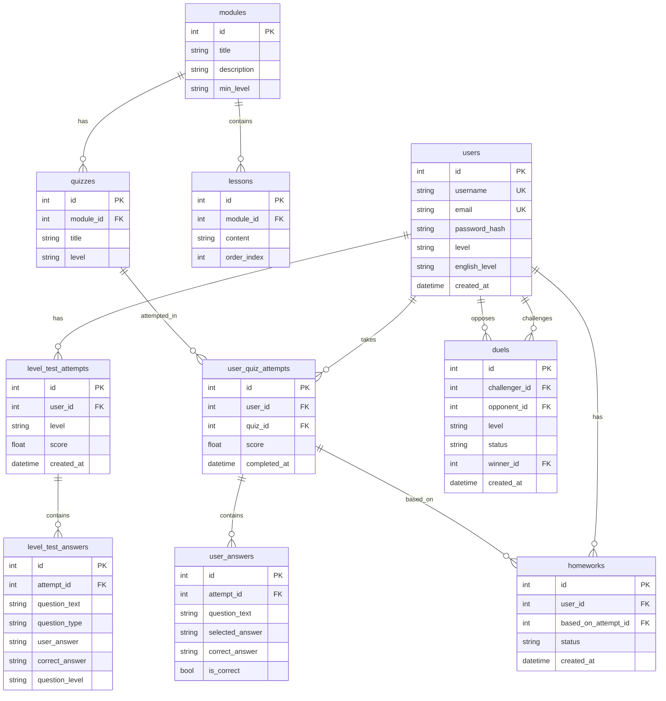

# TalkChem Database ER Diagram

```mermaid
erDiagram
    users {
        int id PK
        string username UK
        string email UK
        string password_hash
        string level
        string english_level
        datetime created_at
    }

    level_test_attempts {
        int id PK
        int user_id FK
        string level
        float score
        datetime created_at
    }

    level_test_answers {
        int id PK
        int attempt_id FK
        string question_text
        string question_type
        string user_answer
        string correct_answer
        string question_level
    }

    modules {
        int id PK
        string title
        string description
        string min_level
    }

    lessons {
        int id PK
        int module_id FK
        string content
        int order_index
    }

    quizzes {
        int id PK
        int module_id FK
        string title
        string level
    }

    user_quiz_attempts {
        int id PK
        int user_id FK
        int quiz_id FK
        float score
        datetime completed_at
    }

    user_answers {
        int id PK
        int attempt_id FK
        string question_text
        string selected_answer
        string correct_answer
        bool is_correct
    }

    homeworks {
        int id PK
        int user_id FK
        int based_on_attempt_id FK
        string status
        datetime created_at
    }

    duels {
        int id PK
        int challenger_id FK
        int opponent_id FK
        string level
        string status
        int winner_id FK
        datetime created_at
    }

    users ||--o{ level_test_attempts : "has"
    level_test_attempts ||--o{ level_test_answers : "contains"
    users ||--o{ user_quiz_attempts : "takes"
    users ||--o{ homeworks : "has"
    modules ||--o{ lessons : "contains"
    modules ||--o{ quizzes : "has"
    quizzes ||--o{ user_quiz_attempts : "attempted_in"
    user_quiz_attempts ||--o{ user_answers : "contains"
    user_quiz_attempts ||--o{ homeworks : "based_on"
    users ||--o{ duels : "challenges"
    users ||--o{ duels : "opposes"
```